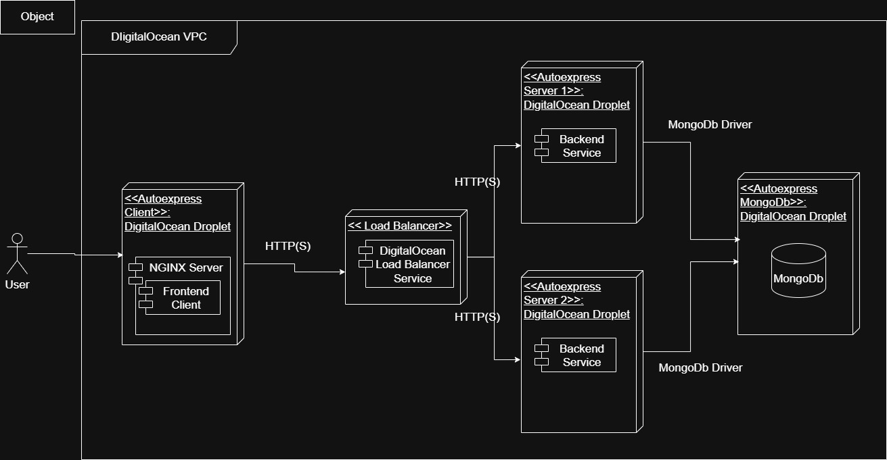

# AutoExpress Infrastructure

This repository contains the infrastructure as code for deploying the AutoExpress MERN stack application on DigitalOcean using Terraform and Ansible.

## Architecture

- **Frontend**: React.js application served by Nginx
- **Backend**: Node.js/Express API (load balanced across 2 instances)
- **Database**: MongoDB in a Docker container
- **Infrastructure**:
  - DigitalOcean Droplets for application servers
  - DigitalOcean Load Balancer for backend traffic
  - VPC for network isolation


## Prerequisites

1. [Terraform](https://www.terraform.io/downloads.html) (v1.0+)
2. [Ansible](https://docs.ansible.com/ansible/latest/installation_guide/intro_installation.html) (v2.10+)
3. [DigitalOcean CLI](https://docs.digitalocean.com/reference/doctl/how-to/install/) (optional)
4. [Python](https://www.python.org/downloads/) 3.8+
5. DigitalOcean account with API access
6. SSH key added to your DigitalOcean account

## Getting Started

1. Clone this repository:
   ```bash
   git clone https://github.com/keilevv/autoexpress-infrastructure.git
   cd autoexpress-infrastructure
   ```

2. Copy the example variables file and update with your values:
   ```bash
   cp terraform.tfvars.example terraform.tfvars
   ```
   Edit `terraform.tfvars` and add your DigitalOcean API token and SSH key fingerprint.

3. Initialize Terraform:
   ```bash
   terraform init
   ```

4. Review the planned changes:
   ```bash
   terraform plan
   ```

5. Apply the configuration (this will create all resources and deploy the application):
   ```bash
   terraform apply
   ```
   Type `yes` when prompted to confirm the changes.

## Deployment Process

The `terraform apply` command will:

1. Create the infrastructure on DigitalOcean (Droplets, Load Balancer, VPC)
2. Generate an Ansible inventory file with the created servers
3. Run the Ansible playbook to:
   - Install Docker and required dependencies
   - Deploy MongoDB in a container
   - Deploy the backend API with load balancing
   - Build and deploy the frontend with Nginx

## Accessing the Application

After the deployment is complete, you can access:

- **Frontend**: http://[frontend-ip]
- **Backend API**: http://[load-balancer-ip]/api

## Configuration

### Environment Variables

- Frontend environment variables are configured in `templates/frontend/.env.j2`
- Backend environment variables are configured in the backend role
- Database connection details are managed by Ansible

### Scaling

To scale the number of backend instances, update the `backend_count` variable in `variables.tf` and run `terraform apply` again.

## Maintenance

### Updating the Application

1. Push your changes to the application repositories
2. Run `terraform apply` to update the infrastructure

### Destroying Resources

To destroy all created resources:

```bash
terraform destroy
```

## Troubleshooting

### Common Issues

1. **SSH Connection Issues**:
   - Ensure your SSH key is added to the SSH agent: `ssh-add ~/.ssh/id_rsa`
   - Verify the SSH key fingerprint in DigitalOcean matches your local key

2. **Ansible Failures**:
   - Run with `-v` for verbose output
   - Check the logs on the target servers with `journalctl -u docker`

3. **Docker Issues**:
   - Check container logs: `docker logs [container-name]`
   - List running containers: `docker ps -a`

## License

This project is licensed under the MIT License - see the [LICENSE](LICENSE) file for details.
