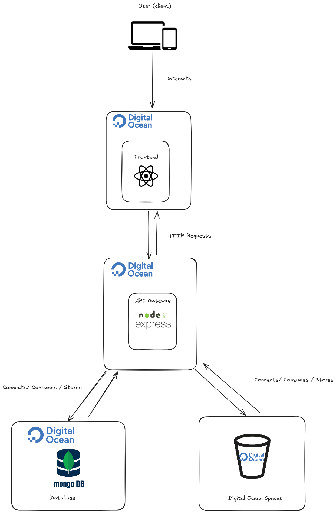

# AutoExpress Infrastructure

This repository contains Terraform and Ansible configurations to deploy the AutoExpress MERN stack application on DigitalOcean.

## Architecture Overview

- **1x** Frontend server (Nginx + React)
- **2x** Backend servers (Node.js)
- **1x** Load Balancer (DigitalOcean Load Balancer)
- **1x** MongoDB server (Docker container)

## Prerequisites

1. [Terraform](https://www.terraform.io/downloads.html) >= 1.0
2. [DigitalOcean CLI](https://docs.digitalocean.com/reference/doctl/how-to/install/) (optional)
3. A DigitalOcean account with API access
4. An SSH key for secure access to your droplets

### Generating an SSH Key (if you don't have one)

1. Generate a new SSH key pair (press Enter to accept the default location and set a passphrase if desired):
   ```bash
   ssh-keygen -t rsa -b 4096 -C "your_email@example.com"
   ```

2. Get the fingerprint of your public key (you'll need this for the `terraform.tfvars` file):
   ```bash
   ssh-keygen -E md5 -lf ~/.ssh/id_rsa.pub | awk '{print $2}'
   ```
   This will output something like: `a8:46:08:7d:64:2a:6d:95:4d:2b:bf:af:7b:5e:28:5d`

3. Add the public key to your DigitalOcean account:
   - Copy the contents of your public key: `cat ~/.ssh/id_rsa.pub`
   - Go to DigitalOcean dashboard > Account > Security > SSH Keys
   - Click "Add SSH Key"
   - Paste your public key and give it a name
   - Click "Add SSH Key"

## Getting Started

1. Clone this repository
   ```bash
   git clone https://github.com/keilevv/autoexpress-infrastructure.git
   cd autoexpress-infrastructure
   ```

2. Copy the example variables file and update with your values
   ```bash
   cp terraform.tfvars.example terraform.tfvars
   ```
   Edit `terraform.tfvars` and add your DigitalOcean API token and SSH key fingerprints.

3. Initialize Terraform
   ```bash
   terraform init
   ```

4. Review the planned changes
   ```bash
   terraform plan
   ```

5. Apply the configuration
   ```bash
   terraform apply
   ```
   Type `yes` when prompted to confirm the changes.

## Accessing the Application

After the deployment is complete, Terraform will output the URLs to access your application:

- **Frontend URL**: Output will show the public IP of the frontend server
- **API Load Balancer**: Output will show the load balancer IP

## Important Notes

- The MongoDB instance is exposed on the private network (10.10.10.0/24) and is accessible only from the backend servers.
- The frontend is configured to proxy API requests to the load balancer.
- Backend servers are automatically registered with the load balancer.

## Cleaning Up

To destroy all created resources:

```bash
terraform destroy
```

## Architecture Diagram


